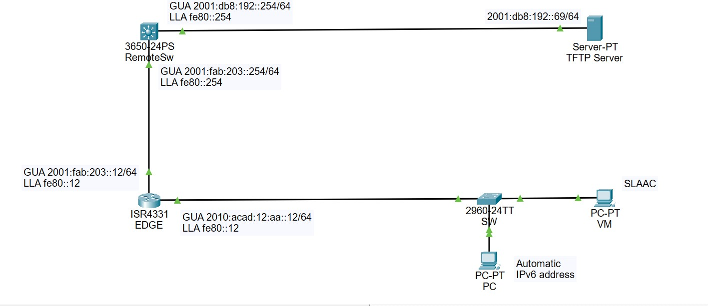

# Lab 03 — IPv6 Neighbour Discovery Protocol (NDP) and SLAAC

## Purpose
Observe and document how IPv6 hosts dynamically discover their local network infrastructure, construct Global Unicast Addresses (GUAs) using SLAAC, and use the Neighbour Discovery Protocol (NDP) to map Layer 3 addresses to Layer 2 MAC addresses.

## Deployment Method
* **Primary Assessment:** To be executed on live physical hardware (Cisco ISR4331 EDGE Router and Alpine Linux VM) inside the Algonquin College in-person networking.
* **Pre-Lab Simulation:** Designed and verified using Cisco Packet Tracer to validate routing tables, SLAAC address scopes, and upstream static path navigation prior to physical deployment.

## Network Topology Context (Pod 12)
* **EDGE Router Hostname:** `hadz0024-EDGE`
* **Local LAN Interface:** `GigabitEthernet0/0/1`
* **Local Network Prefix:** `2010:acad:12:aa::/64`
* **EDGE Gateway Link-Local Address:** `fe80::12`
* **EDGE Gateway Global Address:** `2010:acad:12:aa::12`
* **Alpine VM Target MAC Address:** `02:00:00:00:12:09`

## Core Concepts to be Verified
1. **Stateless Address Autoconfiguration (SLAAC):** Trace the lifecycle from initial host Link-Local creation up to GUA assignment driven by Router Advertisements (RAs).
2. **Neighbour Unreachability Detection (NUD):** Monitor real-time neighbor cache state movements (`STALE` -> `DELAY` -> `PROBE' -> `REACHABLE`) using active ICMPv6 debugging tools.
3. **Duplicate Address Detection (DAD):** Verify how the operating system kernel blocks a duplicate IP address assignment to maintain structural link safety.

## Planned Lab Deliverables Checklist
- [x] **l03-c01-hadz0024.txt:** Verify base script application and manual Gi0/0/1 configuration.
- [x] **l03-c02-hadz0024.txt:** Log the active RS/RA exchange on the router.
- [x] **l03-c03-hadz0024.txt:** Log the NS/NA transaction and neighbor cache table state shifts.
- [x] **l03-c04-hadz0024.txt:** Log the operational behavior of Duplicate Address Detection.
- [x] **l03-c05-hadz0024.txt:** Generate automated end-to-end off-link connectivity logs.
