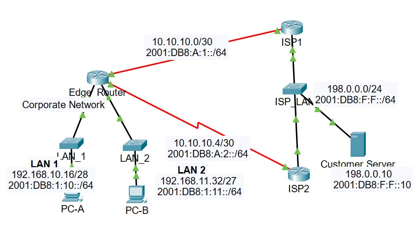

# Lab 04: Configuring IPv4 and IPv6 Static and Default Routes

## Project Description
This repository contains the complete configuration and verification files for the **Lab 04: Configure IPv4 and IPv6 Static and Default Routes** activity as part of the Algonquin College Introduction to Enterprise Networking curriculum. 

The primary objective of this lab is to design, implement, and test an end-to-end routing strategy on an enterprise topology using static, default, floating static backup, and host-specific routes for both IPv4 and IPv6 protocols. 
This layout ensures full network reachability alongside robust WAN link redundancy via dual ISPs.

## Network Topology & Design Goals

The topology features an enterprise edge router (`Edge_Router`) dual-homed to two separate Internet Service Providers (`ISP1` and `ISP2`) using point-to-point WAN Serial connections. The layout achieves:
* **Primary Path Data Flow:** Outbound network traffic favors the high-priority path through `ISP1`.
* **Dynamic Failure Redundancy:** Floating static routes with an Administrative Distance (AD) of `5` stand ready to instantly carry production workloads via `ISP2` if the primary link physically drops.
* **Optimized Server Pathing:** Dedicated `/32` (IPv4) and `/128` (IPv6) host-specific routes guarantee high-priority traffic mapping directly to a critical destination customer server.

---

## Configuration Breakdown

### 1. Edge_Router Configurations
The `Edge_Router` handles default internet connectivity routing and highly targeted traffic isolation to the Customer Server.

```text
! --- IPv4 Static Routing Architecture ---
! Primary Default Gateway via ISP1 (AD = 1)
ip route 0.0.0.0 0.0.0.0 Serial0/0/0

! Floating Backup Default Gateway via ISP2 (AD = 5)
ip route 0.0.0.0 0.0.0.0 Serial0/0/1 5

! Primary Host-Specific Pathing to Customer Server
ip route 198.0.0.10 255.255.255.255 Serial0/0/0

! Floating Host-Specific Backup to Customer Server (AD = 5)
ip route 198.0.0.10 255.255.255.255 Serial0/0/1 5


! --- IPv6 Static Routing Architecture ---
! Global Activation of IPv6 Table Engine
ipv6 unicast-routing

! Primary Next-Hop Default Route via ISP1 Global Address
ipv6 route ::/0 2001:db8:a:1::1

! Floating Next-Hop Backup Default Route via ISP2 (AD = 5)
ipv6 route ::/0 2001:db8:a:2::1 5

! Primary Next-Hop Target Host Route to Customer Server
ipv6 route 2001:db8:f:f::10/128 2001:db8:a:1::1

! Floating Directly-Connected Backup Host Route to Customer Server (AD = 5)
ipv6 route 2001:db8:f:f::10/128 Serial0/0/1 5
```

### 2. ISP1 Configurations
The upstream `ISP1` router must know how to route return packets back to the enterprise internal user subnets (`LAN 1` and `LAN 2`), alongside backup default pathing over to `ISP2`.

```text
! --- IPv4 Inbound LAN Subnet Paths ---
! Next-Hop Subnet Tracking for LAN 1 (/28 Subnet Mask: 255.255.255.240)
ip route 192.168.10.16 255.255.255.240 10.10.10.2

! Next-Hop Subnet Tracking for LAN 2 (/27 Subnet Mask: 255.255.255.224)
ip route 192.168.11.32 255.255.255.224 10.10.10.2

! --- IPv4 Multi-Access Floating Inter-ISP Paths ---
ip route 192.168.10.16 255.255.255.240 198.0.0.2 5
ip route 192.168.11.32 255.255.255.224 198.0.0.2 5


! --- IPv6 Inbound LAN Subnet Paths ---
! Next-Hop Subnet Tracking for LAN 1 Subnet Block
ipv6 route 2001:db8:1:10::/64 2001:db8:a:1::2

! Next-Hop Subnet Tracking for LAN 2 Subnet Block
ipv6 route 2001:db8:1:11::/64 2001:db8:a:1::2

! --- IPv6 Next-Hop Floating Inter-ISP Paths ---
ipv6 route 2001:db8:1:10::/64 2001:db8:f:f::2 5
ipv6 route 2001:db8:1:11::/64 2001:db8:f:f::2 5
```

---

## Verification & Testing Methodology
Full end-to-end operations and routing table behavior were validated with the following procedures inside the Cisco Packet Tracer terminal environment.

### 1. Functional Connectivity Test
* **IPv6 Target Verification:** Standard ICMP Echo requests originating from `PC-A` successfully reach the remote server target loopback interface.
  ```text
  C:\> ping 2001:db8:f:f::10
  Pinging 2001:db8:f:f::10 with 32 bytes of data:
  Reply from 2001:DB8:F:F::10: bytes=32 time=1ms TTL=126
  Reply from 2001:DB8:F:F::10: bytes=32 time=1ms TTL=126
  Ping statistics: Sent = 4, Received = 4, Lost = 0 (0% loss)
  ```

### 2. Path Trace Verification (Longest-Match Rule Validation)
* Running a traceroute confirms that packets heading toward the Customer Server target are explicitly processed via our optimized host route rather than matching the catch-all default pathing topology.
  ```text
  C:\> tracert 198.0.0.10
  Tracing route to 198.0.0.10 over a maximum of 30 hops:
    1    <1 ms    1 ms    192.168.10.17  (Edge_Router Inbound Gateway)
    2    12 ms    1 ms    10.10.10.1     (ISP1 Serial Node Interface)
    3     0 ms    1 ms    198.0.0.10     (Customer Server Target Dest)
  Trace complete.
  ```

### 3. Redundancy Failover Simulation
* By executing a manual interface shutdown on the primary outbound pipeline interface (`interface Serial0/0/0`), the internal router system safely cleared the dead static routes.
  The `Edge_Router` seamlessly promoted the floating static routes (configured with an AD of 5) into the active routing table matrix, routing user packets through the secondary path via `ISP2` without losing communication channels.
